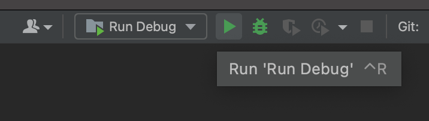
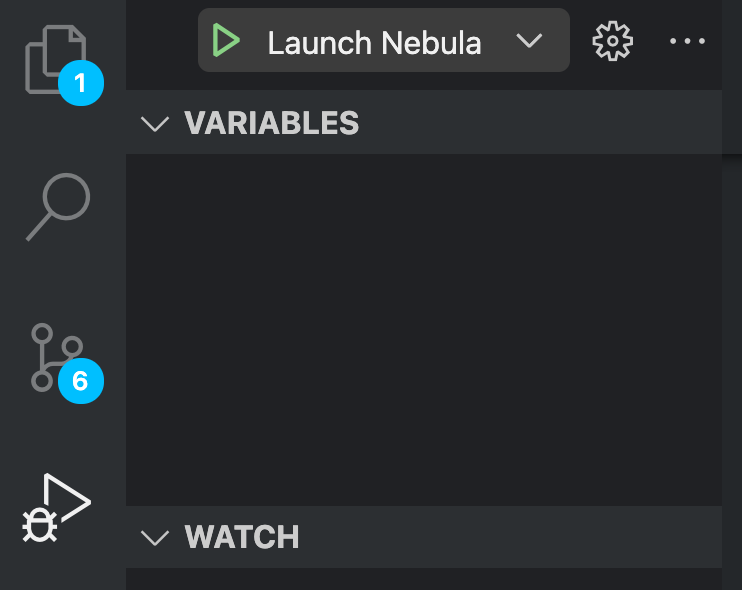

# Nebula Carina

> Cross platform automation tools that provide the easiest and most efficient way of securing limited items.

## Table of Contents

- [Prerequisites](#prerequisites)
- [Setup](#setup)
- [Running the Project](#running)

## Setup

### Windows

- Clone the repo
- Run `cd scripts && bootstrap.bat`. This will setup the environment for you.

### Unix

- Clone the repo
- Run `cd scripts && bootstrap.sh`. This will setup the environment for you.

## Running

It is recommended to use [Goland](https://www.jetbrains.com/go/) or [Visual Studio Code](https://code.visualstudio.com/) since we have launch configurations that will make your life easier. Feel free to use whatever IDE you please though.

### Goland

- Open the root folder
- Hit the run button with `Run Debug` configuration selected
  

### Visual Studio Code

- Open the root folder
- Hit the run button with `Launch Nebula` configuration selected
  

### Manually

- Run `yarn start` from the web folder
- Run `go run cmd/api/main.go`
- Run `go run cmd/watcher/main.go`

### Watcher

- Run `yarn start` from the web folder
- Run `go run cmd/watcher/main.go -config=config/watcher/bot.toml`
- Run `go run cmd/watcher/main.go -config=config/watcher/api.toml`
